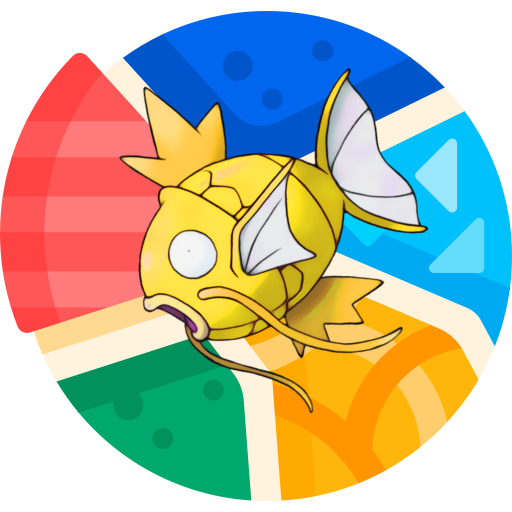

# StockCarp!

I was interested in Monte Carlo Tree Search and I love pokemon, so I created StockCarp.

StockCarp is a battling bot for the competitive pokemon format VCG. Everything is coded from scratch.

I am aware that there is a whole infrastructure with smogon and pokemon showdown where I could implement it faster. But I was interested in improving my coding so I recreated the whole pokemon battle enviorment.
The two main algorithms are a basic UCT for move selection during battle, and a really easy exploration with random rollouts for the team members selection.

**Future**
-I need to include abilities and items.
-Continue including secondary effects of moves.
-Host a Web where anyone can play against my AI's.

